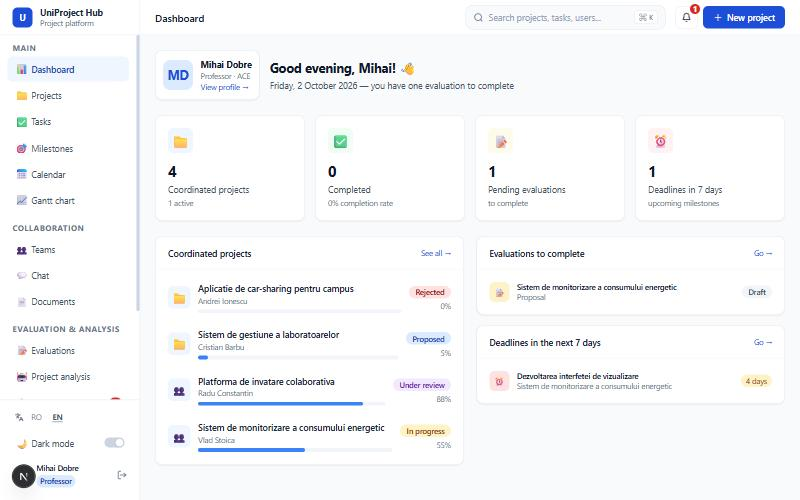
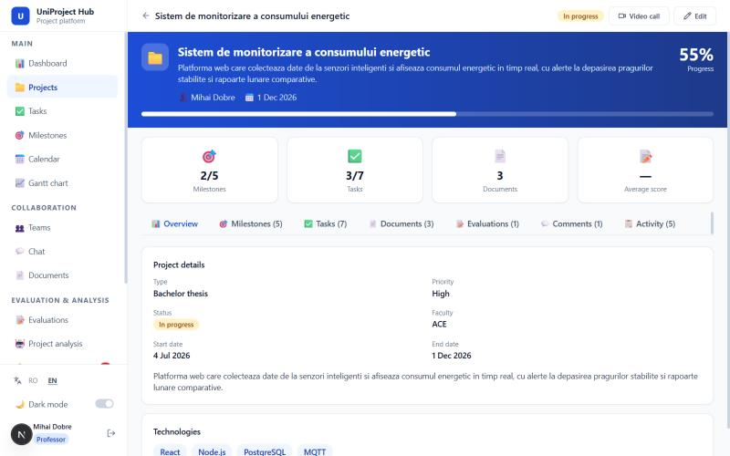
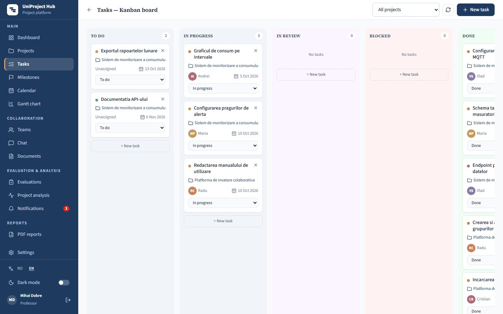
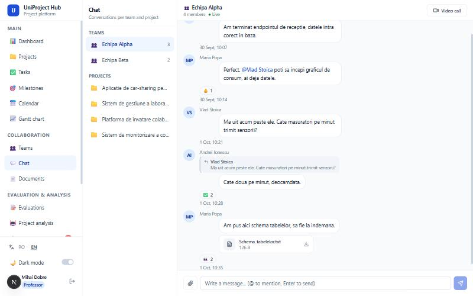
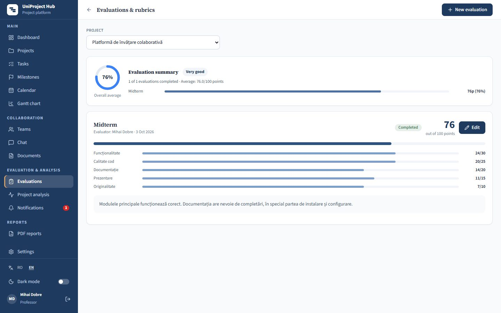
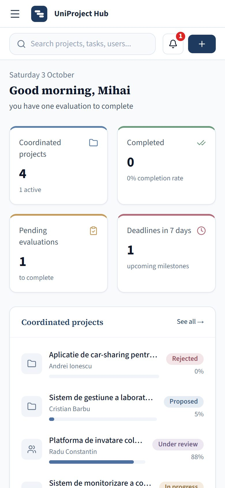

# UniProject Hub

A web platform for managing university student projects: teams, milestones, tasks, documents,
evaluations with rubrics, chat and PDF reports, in one place. It started as my bachelor thesis and is
maintained as a portfolio project.

**Live demo:** [uniprojecthub-demo.vercel.app](https://uniprojecthub-demo.vercel.app) — one-click student and
professor accounts on the sign-in page; data is reset daily. The free API server sleeps when idle, so the first
request can take up to a minute.

**Stack:** Next.js 15 · React 19 · TypeScript · Tailwind CSS — NestJS 11 · TypeORM · PostgreSQL

The interface is available in **Romanian and English** (switchable at any time).

## Screenshots

| Dashboard | Project page |
|---|---|
|  |  |
| **Kanban board** | **Team chat** |
|  |  |
| **Evaluations** | **On a phone** |
|  |  |

## Features

- **Roles** — students, professors (coordinators) and administrators, with permissions enforced on the
  server for every project, team and document (the interface only shows the actions a user is allowed to do).
- **Projects** — create from scratch or from a template (milestones generated automatically), statuses
  from draft to completed, favorites, team or individual projects.
- **Planning** — milestones with deliverables and attached documents, a Kanban task board,
  a calendar (month/week) and a Gantt chart.
- **Teams** — join requests handled by the team leader or professors, direct member management.
- **Evaluations** — standard 100-point rubric per project phase; corrections of a completed evaluation
  require a reason and are kept in a history visible to the team.
- **Collaboration** — per-team and per-project chat with mentions, replies, reactions and attachments,
  project comments, activity history, and a video-call button (Jitsi Meet).
- **Notifications** — in-app and (optionally) by email, generated on the server for the people involved,
  with per-user preferences.
- **Analysis & reports** — a transparent, rule-based project health analysis (progress, time,
  organization, documentation, stability) and PDF reports per project or per student.
- **Accounts & privacy** — email verification, optional security PIN as a second sign-in step,
  account lockout after repeated failures, account deletion with anonymization (GDPR), bilingual
  privacy policy and terms.
- **Accessibility & responsiveness** — labelled form fields, keyboard-operable menus and dialogs,
  screen-reader announcements, and a layout that works on phones.

## Architecture

```
frontend/   Next.js App Router (client components)          backend/   NestJS REST API (/api/v1)
  src/app/(dashboard)/  one folder per page,                  src/<module>/  controller · service · dto · entities
                        split into small components           src/access/    project/team access rules (single source of truth)
  src/components/       layout + shared UI (Modal, Field,…)   src/common/    error catalog, exception filter, guards
  src/i18n/             typed RO/EN dictionaries              src/database/  TypeORM migrations + demo seed
  src/lib/              API client, permissions, helpers      test/          authorization tests against the real API
```

- **Auth:** short-lived JWT access tokens plus rotating refresh tokens (stored hashed). All routes are
  protected by default; public routes are explicitly marked.
- **Authorization:** one service (`ProjectAccessService`) decides who may read or change a project,
  team or document; resources a user cannot access return 404.
- **Validation:** every request body has a DTO (class-validator); unknown fields are rejected.
- **Errors:** every error has a stable code (e.g. `PROJECT_NOT_FOUND`) that the frontend translates.
- **Database:** schema managed by migrations, applied automatically on start.
- **Security:** Helmet, CORS, rate limiting (stricter on auth routes), CSP in production, uploads
  restricted by type and served as downloads.

## Getting started

Requirements: Node.js 20+, and PostgreSQL 14+ (or Docker).

```bash
# 1. Database
docker compose up -d

# 2. Backend (http://localhost:4000/api/v1, API docs at /api/docs)
cd backend
cp .env.example .env     # set DB_PASSWORD, JWT_SECRET and JWT_REFRESH_SECRET
npm install
npm run seed             # optional: demo data
npm run start:dev

# 3. Frontend (http://localhost:3000)
cd ../frontend
cp .env.local.example .env.local
npm install
npm run dev
```

Without `MAIL_USER` configured, emails (including verification codes) are printed in the backend console.

**Demo accounts** (after `npm run seed`, password `password123`): `admin@example.com`, `prof@example.com`,
`andrei.ionescu@student.example.com`.

## Deployment (public demo)

The live demo runs on free tiers: **Vercel** (frontend), **Render** (API, `render.yaml`) and **Supabase**
(PostgreSQL, Frankfurt region).

- `SHOWCASE_MODE=true` / `NEXT_PUBLIC_SHOWCASE=true` turn on demo mode: one-click demo accounts on the sign-in
  page, shared demo accounts can't change their password or be deleted, and all data (including accounts created
  by visitors) is reloaded from the seed on every start and every night.
- The API start command (`npm run start:showcase`) applies the migrations, reloads the demo data, then starts the
  server. Render's free instances sleep when idle, so the first request after a quiet period can take up to a minute.
- Emails are optional and go through any SMTP provider (`MAIL_HOST`, `MAIL_USER`, `MAIL_PASS`, `MAIL_FROM`).
  Without them, the demo activates new accounts right away (no email code) and hides the password reset.

## Quality checks

| | Backend | Frontend |
|---|---|---|
| Lint | `npm run lint` | `npm run lint` |
| Types | `npm run typecheck` | `npx tsc --noEmit` |
| Build | `npm run build` | `npm run build` |
| Tests | `npm test` — authorization matrix against the running API | — |

The same checks run on every push in GitHub Actions (`.github/workflows/ci.yml`), with a fresh
PostgreSQL database.

## License

[MIT](LICENSE)
